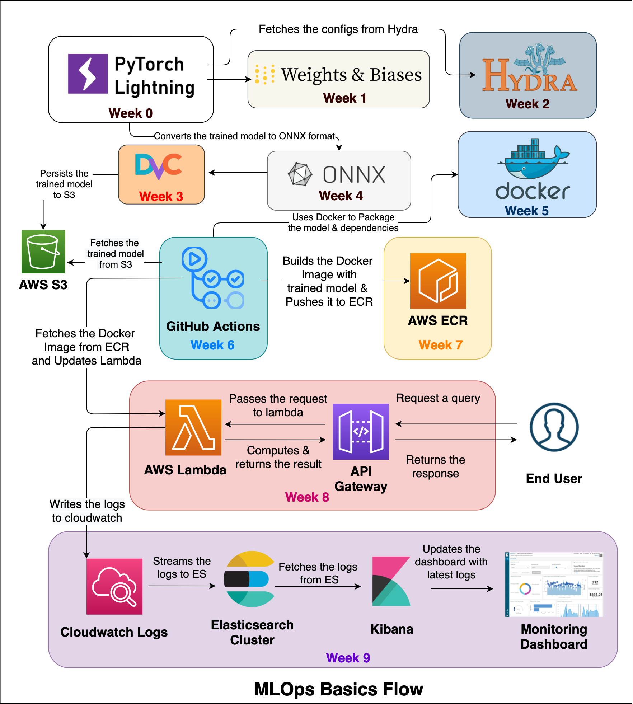

# MLOps

A self-paced course on mastering MLOps all the way from basics. 

### 1. MLOps-Basics  

This [MLOps-Basics](https://github.com/graviraja/MLOps-Basics) series by [Raviraja](https://github.com/graviraja) gives an overview of the fundamentals including model building, monitoring, configurations, testing, packaging, deployment, ci/cd, etc as shown below. 

